# Resumo Executivo - Sistema de Busca de Leilões

## 🎯 Objetivo Geral

Integrar um **sistema maduro de scraping de 7 sites de leilões** ao projeto React, criando uma plataforma centralizada para buscar, filtrar e gerenciar lotes de sucata de veículos em tempo real.

---

## 📊 Arquitetura do Sistema

```mermaid
graph TB
    subgraph Frontend["🎨 Frontend (React + Vite)"]
        App["App.tsx"]
        AuctionPage["AuctionSync.tsx"]
        Hook["useAuctions.ts"]
    end

    subgraph Backend["⚙️ Backend (Express + Node.js)"]
        Server["server.ts"]
        Routes["routes/auctions.ts"]
        
        subgraph Services["Services (Scrapers)"]
            Leiloes["leiloesScraper.ts"]
            Sodre["sodreScraper.ts"]
            Superbid["superbidScraper.ts"]
            Copart["copartScraper.ts"]
            Autotran["autotranScraper.ts"]
            Pestana["pestanaScraper.ts"]
            Marca["marcaLeiloesScraper.ts"]
        end
        
        Utils["utils/validadorSucata.ts"]
        Config["config/index.ts"]
    end

    subgraph External["🌐 Externos"]
        LeiloesMS["leiloesonlinems.com.br"]
        SodreAPI["sodresantoro.com.br/api"]
        Superbid["exchange.superbid.net"]
        CopartAPI["copart.com.br/public"]
        AutotranSite["autotranleiloes.org"]
        PestanaSite["pestanaleiloes.com.br"]
        MarcaSite["marcaleiloes.com.br"]
        N8N["N8N Webhook"]
    end

    subgraph Database["💾 Banco de Dados"]
        PostgreSQL["PostgreSQL"]
        AuctionTable["auction_lots"]
        SyncLogs["sync_logs"]
    end

    %% Conexões Frontend-Backend
    App -->|POST /api/auctions/sync/:source| Routes
    AuctionPage -->|GET /api/auctions| Routes
    Hook -->|Axios/Fetch| Routes
    
    %% Conexões Backend Services
    Routes -->|Chama| Leiloes
    Routes -->|Chama| Sodre
    Routes -->|Chama| Superbid
    Routes -->|Chama| Copart
    Routes -->|Chama| Autotran
    Routes -->|Chama| Pestana
    Routes -->|Chama| Marca
    
    Leiloes -->|Validação| Utils
    Sodre -->|Validação| Utils
    Superbid -->|Validação| Utils
    Copart -->|Validação| Utils
    Autotran -->|Validação| Utils
    Pestana -->|Validação| Utils
    Marca -->|Validação| Utils
    
    %% Scrapers → Sites Externos
    Leiloes -->|GET| LeiloesMS
    Sodre -->|POST| SodreAPI
    Superbid -->|GET| Superbid
    Copart -->|POST| CopartAPI
    Autotran -->|GET| AutotranSite
    Pestana -->|GET| PestanaSite
    Marca -->|GET| MarcaSite
    
    %% Services → N8N
    Leiloes -->|POST lotes| N8N
    Sodre -->|POST lotes| N8N
    Superbid -->|POST lotes| N8N
    Copart -->|POST lotes| N8N
    Autotran -->|POST lotes| N8N
    Pestana -->|POST lotes| N8N
    Marca -->|POST lotes| N8N
    
    %% N8N → Database
    N8N -->|Upsert| AuctionTable
    N8N -->|Log| SyncLogs
    
    %% Database → Frontend
    AuctionTable -->|GET| Routes
    Routes -->|JSON| Hook
    
    style Frontend fill:#e1f5ff
    style Backend fill:#f3e5f5
    style External fill:#fff3e0
    style Database fill:#e8f5e9
```



---

## 🔄 Fluxo de Dados

### Ciclo de Sincronização (Manual ou Automático)

```
1. Frontend → Backend
   POST /api/auctions/sync/sodre
   
2. Backend → Site Externo
   GET/POST https://sodresantoro.com.br/...
   (Playwright abre browser, extrai dados)
   
3. Validação
   ✓ É sucata veicular válida?
   ✓ Tipo: aproveitável ou inservível?
   ✓ Dados completos? (imagem, datas, link)
   
4. Backend → N8N Webhook
   POST https://leiloes-n8n.ini6ln.easypanel.host/...
   Body: { lotes: [{...}, {...}] }
   
5. N8N → PostgreSQL
   INSERT/UPDATE auction_lots table
   Realtime event dispatchado
   
6. Frontend escuta Realtime
   Tabela atualiza automaticamente
   Toast notifica: "42 novos lotes!"
```

---

## 📈 Funcionamento Esperado

### Após Implementação

#### ✅ Cenário 1: Sincronização Manual

```
Usuário clica botão "Sincronizar Sodré"
  ↓
Backend: Acessa Sodré (Playwright + API)
  ↓
Backend: Extrai ~100 lotes com datas e imagens
  ↓
Backend: Envia para N8N webhook
  ↓
N8N: Processa, valida, salva no PostgreSQL
  ↓
Frontend: Recebe realtime update
  ↓
Tabela exibe: "Sodré - 100 lotes adicionados"
```

#### ✅ Cenário 2: Sincronização Automática (Scheduler)

```
2:00 AM → Cron: /api/auctions/sync/leiloes-ms
          /api/auctions/sync/superbid
          /api/auctions/sync/copart
          
5:30 AM → Cron: /api/auctions/sync/sodre
          /api/auctions/sync/autotran
          /api/auctions/sync/pestana
          /api/auctions/sync/marca-leiloes
          
Usuário acorda, abre app:
  ↓
  Vê 400+ novos lotes (de todos os sites)
  Filtra por: tipo, fonte, data encerramento
  Clica em um lote, abre no site original
```

#### ✅ Cenário 3: Filtros & Busca

```
GET /api/auctions?type=inservivel&fonte=sodre&search=toyota

Retorna:
[
  {
    numero_lote: "1234-5678",
    veiculo_origem: "SUCATA - TOYOTA COROLLA",
    tipo_sucata: "inservivel",
    fonte: "Sodré Santoro",
    auction_end_at: "2026-06-20T14:00:00Z",
    link_leilao: "https://..."
  },
  ...
]
```

---

## 🎯 Benefícios da Solução

| Aspecto | Antes | Depois |
|---------|-------|--------|
| **Fontes de Leilões** | Uma (manual) | 7 (automático) |
| **Tempo de Busca** | 30+ minutos | < 1 segundo |
| **Atualização** | Manual (diária?) | Automática (a cada 2-3h) |
| **Escalabilidade** | Baixa | Alta (fácil adicionar site) |
| **Cobertura** | Incompleta | Completa (Sodré, Copart, etc) |
| **Validação** | Manual | Automática + N8N |
| **Realtime** | Não | Sim (PostgreSQL) |

---

## 📦 Dependências Necessárias

### Backend

```json
{
  "dependencies": {
    "express": "^4.21.2",
    "axios": "^1.6.0",
    "cheerio": "^1.0.0",
    "playwright": "^1.40.0",
    "dotenv": "^17.2.3",
    "cors": "^2.8.5",
    "node-schedule": "^2.1.0",
    "typescript": "~5.8.2"
  }
}
```

### Frontend (já tem)

```json
{
  "dependencies": {
    "react": "^19.0.1",
    "@tanstack/react-query": "^5.101.0",
    "axios": "^1.6.0"
  }
}
```

---

## 🛠️ Estimativa de Esforço

| Fase | Tarefa | Tempo | Status |
|------|--------|-------|--------|
| 1 | Setup backend structure | 15 min | ⏭️ |
| 2 | Criar utilitários (validator, config) | 20 min | ⏭️ |
| 3 | Copiar + adaptar 7 scrapers | 45 min | ⏭️ |
| 4 | Criar rotas Express | 30 min | ⏭️ |
| 5 | Criar hook React + componente | 30 min | ⏭️ |
| 6 | Testar cada scraper | 1h | ⏭️ |
| 7 | Integrar com N8N | 30 min | ⏭️ |
| 8 | Automação (scheduler) | 20 min | ⏭️ |
| **Total** | | **4h 30m** | |

---

## 🔐 Segurança & Performance

### Segurança

- ✅ N8N valida dados antes de salvar
- ✅ PostgreSQL com autenticação e RLS
- ✅ Variáveis de ambiente (sem hardcode de webhooks)
- ✅ CORS configurado

### Performance

- ✅ Paginação em Superbid/AutoTran
- ✅ Pausa entre requisições (anti-bloqueio)
- ✅ Scheduler com timing defasado (não satura BD)
- ✅ Caching React Query no frontend

---

## 🚨 Riscos & Mitigação

| Risco | Probabilidade | Impacto | Mitigação |
|-------|---------------|--------|-----------|
| Site bloqueia scraper | Média | Alto | Usar Playwright stealth, rotacionar UA |
| Webhook N8N cai | Baixa | Alto | Fila de retry (Bull), alertas |
| Muitos lotes → lentidão | Média | Médio | Paginação DB, índices PostgreSQL |
| Parse HTML quebra | Média | Médio | Validação rigorosa, logs detalhados |
| Duplicatas de lote | Média | Médio | Usar `numero_lote` como UNIQUE |

---

## 📞 Próximas Ações

### Imediatas (Hoje)
- [ ] Revisar este documento
- [ ] Preparar ambiente backend
- [ ] Começar com Fase 1 (setup structure)

### Curto Prazo (Esta Semana)
- [ ] Implementar Fases 1-4 (Backend)
- [ ] Copiar + adaptar scrapers
- [ ] Testar cada scraper isoladamente

### Médio Prazo (Próximas 2 Semanas)
- [ ] Frontend React (Fase 5)
- [ ] Integração com PostgreSQL
- [ ] Testes E2E

### Longo Prazo (Produção)
- [ ] Scheduler automático (Fase 6)
- [ ] Alertas em tempo real
- [ ] Dashboard analytics

---

## 📚 Referências

- **Documentação**: [ANALISE_INTEGRACAO_SCRAPERS.md](./ANALISE_INTEGRACAO_SCRAPERS.md)
- **Detalhes Técnicos**: [DETALHES_TECNICOS_SCRAPERS.md](./DETALHES_TECNICOS_SCRAPERS.md)
- **Plano Detalhado**: [PLANO_INTEGRACAO_COMPLETO.md](./PLANO_INTEGRACAO_COMPLETO.md)
- **Webhook N8N**: https://leiloes-n8n.ini6ln.easypanel.host/webhook-test/ca21f95f-ea9c-4b88-a3dc-4db8b4035655

---

## ✅ Decisão

**Status**: 🟢 **PRONTO PARA INICIAR IMPLEMENTAÇÃO**

Você tem:
- ✅ 7 scrapers funcionais e testados
- ✅ Webhook N8N configurado
- ✅ Arquitetura clara definida
- ✅ Plano detalhado de integração
- ✅ Código de exemplo para cada fase

**Próximo passo**: Comece pela **Fase 1** (setup `/backend`) e avance sequencialmente.

---

**Documento gerado em**: 14/06/2026 22:14 UTC  
**Versão**: 1.0  
**Status**: ✅ Análise Completa
